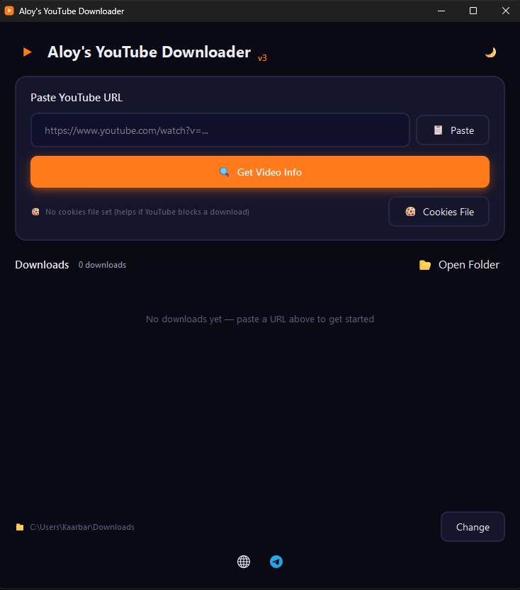

# Aloy's YouTube Downloader 🎬

**Paste a link, pick a format, and download.**

Aloy's YouTube Downloader is a standalone Windows utility that grabs YouTube videos and audio in multiple formats. No installation required.

> **Note:** This is a closed-source project. All rights are reserved.

---

## 🚀 Features

- **Paste & Go:** Paste a YouTube URL and click "Get Video Info".
- **Video Info Fetching:** Retrieves video details and available formats before downloading.
- **Multiple Formats:** Download video and audio in a variety of quality and container options.
- **Cookie Support:** Load a cookies file to help if YouTube blocks your download request.
- **Open Folder Shortcut:** One-click button to open your current download directory.
- **Light/Dark Theme:** Toggle between a dark or light interface.

---

## 💻 Installation (Portable)

Fully portable. No installation is needed.

1. Download the latest `.zip` from the **[Releases page](https://github.com/actually-aloy/aloys-youtube-downloader/releases)**.
2. Extract the zip to any folder on your PC.
3. Run `Aloys YouTube Downloader.exe` to launch the app.

---

## 📸 Screenshot

  

---

## 📞 Contact

Got questions or feedback? Hit me up on Telegram: [@actually_aloy](https://t.me/actually_aloy)

---

 

# 📖 فارسی (Persian)

## 🚀 درباره برنامه

**Aloy's YouTube Downloader** یک ابزار دسکتاپ ویندوز برای دانلود ویدیو و صدا از یوتیوب در فرمت‌های مختلف است. نیازی به نصب ندارد.

> **نکته:** این پروژه متن‌باز نیست و کلیه حقوق آن محفوظ است.

---

## ✨ امکانات

- **Paste & Go:** لینک یوتیوب را کپی کنید و دکمه "Get Video Info" را بزنید.
- **دریافت اطلاعات:** جزئیات ویدیو و فرمت‌های قابل دانلود را قبل از دانلود نمایش می‌دهد.
- **فرمت‌های متنوع:** امکان دانلود ویدیو و صدا با کیفیت‌ها و کانتینرهای مختلف.
- **پشتیبانی از کوکی:** بارگذاری فایل کوکی برای مواقعی که یوتیوب دانلود را مسدود می‌کند.
- **دسترسی سریع به پوشه:** دکمه‌ای برای باز کردن مستقیم پوشه دانلودها.
- **تم روشن/تاریک:** قابلیت تغییر بین رابط کاربری تاریک و روشن.

---

## 💻 نصب (پرتابل / نیازی به نصب نیست)

کاملاً پرتابل است و نیازی به نصب ندارد.

۱. آخرین فایل `.zip` را از صفحه **[Releases](https://github.com/actually-aloy/aloys-youtube-downloader/releases)** دانلود کنید.
۲. فایل زیپ را در هر پوشه‌ای روی سیستم خود از حالت فشرده خارج کنید.
۳. فایل `Aloys YouTube Downloader.exe` را اجرا کنید.

---

## 📸 تصویر

  

---

## 📞 ارتباط با من

سوال یا پیشنهادی دارید؟ تلگرام: [@actually_aloy](https://t.me/actually_aloy)
